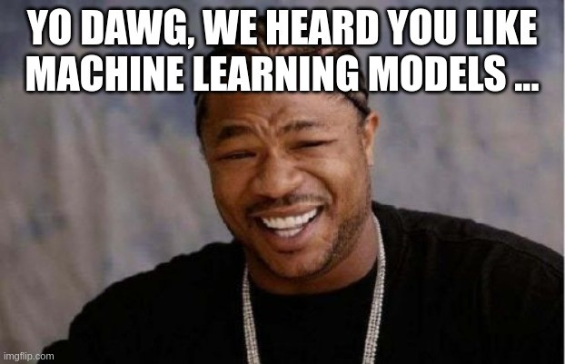

[][license]

[license]: LICENSE

**Disclaimer: This is just a fun experiment, I conducted for my own curiosity and entertainment. It's not intended to be
useful for anything else.**

# Yo-dawg-ml-model architecture



The Yo-dawg-ml-model architecture (also known as the Yung-Kofman-Hermann architecture) is a generalization of the
classical decision trees.
Instead of the decision nodes splitting the data on a simple feature threshold, arbitrary model types (linear
regression, support-vector machine, multi-layer perceptron) are put in place here.
In addition, the leaf nodes also don't have a fixed value, and sub-models do the prediction part here too.

## When is this helpful?

- Probably never!
- You'd like to introduce additional complexity and computational cost.

## When is this not useful?

- Almost always!

So, **it is highly recommended to not actually use this for anything serious**.

## Implementation

The basis is a simplified standard recursive decision-tree implementation using the Gini impurity to select a good
decider on each node. It can only handle numerical features and only supports regression (not classification).
It gives (at least for the training set) similar results to the scikit-learn implementation:

```
Train RMSE: 234307.29021948934
Test RMSE: 2020800.0165108559

sklearn.tree train RMSE: 234307.29021948934
sklearn.tree Test RMSE: 1886618.9323697414
```

With the advanced deciders enabled, it still works, gives better results on the test set than the "boring" version,
and sometimes (with some luck) even gives better results on the test set than the scikit-learn tree (cherry-picked
result below):

```
Train RMSE: 234307.29021948934
Test RMSE: 1873213.1994037377
```

## Origin story

Our team was working on predicting specific scores for images.
At one point, we tested something like this:

```python3
score = model_a.predict(image)
if score > 0.8:
    score = model_b.predict(image)
```

**Obviously** this is actually a small decision tree,
with decision thresholds being applied to a model score instead of a simple input feature.
So this repository is the logical consequence of expanding on this idea.
